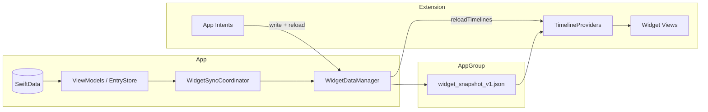

**Estimated release:** `1.2` (phased — see §8)

# Home Screen Widget Specification

## 1. Purpose

Define a **family of focused widgets** for TrackBoth — not one generic “habit tracker” tile. Each widget answers a different daily question while reusing the same app-group snapshot and domain math.

**Positioning:** Clean Slate widgets skew quit-only (live vice timers). TrackBoth widgets must surface **both** habit building and vice recovery in one glance, with optional deep focus on a single metric.

**Status:** Planned — **cut from lean 1.0.0**. Gated by `ProductSurface.showsWidget`. See [`ProductSurfaceSpec.md`](../ProductSurfaceSpec.md).

**Related:** [`TrackingSemanticsSpec.md`](../TrackingSemanticsSpec.md) · [`HomeSpec.md`](../HomeSpec.md) · [`docs/product/competitive-strategy.md`](../../docs/product/competitive-strategy.md)

---

## 2. Design principles

| Principle | Rule |
|-----------|------|
| **One job per widget** | User picks the focus in the widget gallery; we don’t cram habits + vices + goals + money into every size. |
| **Domain parity** | Streaks, completion, recovery, savings must match Home/History — delegate to `StreakUtils`, `TrackingSemantics`, `ViceSlipTimer`, `ViceSavingsCalculator`, `GoalUtils`. |
| **Log without opening app** | Medium+ widgets and Control Widget support one-tap log where App Intents allow. |
| **Configurable pin** | Streak / recovery / savings widgets bind to **one chosen metric**; daily widgets can filter habits-only or vices-only. |
| **Honest empty states** | “No metrics yet”, “Not logged today”, “Enable cost in app” — never fake data. |
| **Battery-aware refresh** | Prefer snapshot push from app + midnight rollover; avoid per-second Live Activity for recovery (competitive skip). |

---

## 3. Widget catalog

Each row is a **separate widget** in `TrackBoth_WidgetBundle` (distinct `kind` + gallery name).

### 3.1 Today’s Progress — `TodayProgressWidget`

**Question:** *How am I doing today?*

| Size | Layout |
|------|--------|
| **Small** | Ring or fraction: `todayCompleted / totalMetrics`. Subtitle: “X habits · Y vices left”. App icon + date. |
| **Medium** | Left: today ring + stats. Right: up to 4 **unlogged** metrics as tappable chips (habit check / vice avoided). Overflow: “+N more in app”. |

**Config:** None (always all metrics) or optional “Habits only” / “Vices only” filter.

**Tap:** Opens Home. Chip tap runs `TrackBothLogIntent` for that metric.

**Priority:** **P0 — ship first**

---

### 3.2 TrackBoth Log — `TrackBothLogWidget`

**Question:** *Let me log in two taps.*

| Size | Layout |
|------|--------|
| **Medium** | Two sections: Habits (green) and Vices (red). Up to 3 rows each with name + toggle. Vice rows with recovery timer on show `compactRecoveryLabel` under name when a prior slip exists. |
| **Large** | Same as medium + week strip (7 dots) for **selected metric** on row long-press preview, or global week summary in footer. |

**Config:** Sort: default order / name / streak. Max rows per section (3–5). Show quantity subtitle when metric has quantity unit.

**Interactions:**

| Action | Intent | Semantics |
|--------|--------|-----------|
| Tap toggle (habit) | `TrackBothLogIntent` | Log today `value: true` |
| Tap toggle (vice, off→on) | `TrackBothLogIntent` | Log today `value: false` (avoided) |
| Tap logged row | `OpenLoggingSheetIntent` | Deep link to app LoggingSheet for today |
| Tap section header | — | Open Home filtered (future) |

**Priority:** **P0**

---

### 3.3 Streak Spotlight — `StreakSpotlightWidget`

**Question:** *How long is my streak on the thing I care about?*

| Size | Layout |
|------|--------|
| **Small** | Large number + “day streak”. Metric name (truncated). Habit: flame + success color. Vice: shield + “clean days”. **Vice + recovery timer on:** subtitle from `ViceSlipTimer.compactRecoveryLabel` under streak (matches Home row). |
| **Medium** | Small layout + 7-day strip (success/fail/missing) + “Best: N days”. Recovery subtitle when applicable. |

**Config:** **Required** — pick one `Metric` (App Entity). Suggested default: highest active streak among user metrics.

**Tap:** Open Home with metric highlighted (scroll target).

**Recovery:** When pinned metric is a vice with `showRecoveryTimer`, prefer recovery label as hero on **Small** if streak &lt; 7 and recovery ≥ 7 days (user picked this vice to watch recovery).

**Priority:** **P0**

---

### 3.4 Vice Recovery — `ViceRecoveryWidget`

**Question:** *How long have I been recovering since my last slip?*

| Size | Layout |
|------|--------|
| **Small** | “14d recovering” (from `ViceSlipTimer.compactRecoveryLabel`) + metric name. Secondary: clean-day count. |
| **Medium** | Recovery label prominent + last slip date (relative) + mini streak strip since slip. |

**Config:** Pick one **vice** metric. Show placeholder if recovery timer disabled: “Turn on in Edit Metric”.

**Eligibility:** `habitType == .vice` only. Respect `MetricDisplayPreferences.showTimeSinceSlip` — if off, widget shows clean days only (no recovery copy).

**Tap:** Open Home row (or Edit Metric if recovery timer off).

**Priority:** **P0** — ship with Phase A (pairs with in-app recovery on Home + History)

---

### 3.5 Money Saved — `MoneySavedWidget`

**Question:** *How much have I saved by staying clean?*

| Size | Layout |
|------|--------|
| **Small** | Currency amount (large) + “saved” + metric name. Subtitle: “N clean days”. |
| **Medium** | Amount + streak + optional motivation line (`primaryMotivation` truncated). |

**Config:** Pick one vice with `costPerUnit` set.

**Eligibility:** Requires `MetricCostStore` cost > 0. Empty state: “Add cost per unit in app”.

**Domain:** `ViceSavingsCalculator.savingsLabel(streak:costPerUnit:)`.

**Priority:** **P1**

---

### 3.6 Goal Progress — `GoalProgressWidget`

**Question:** *Am I on track for my monthly goal?*

| Size | Layout |
|------|--------|
| **Medium** | Up to 2 goals: name, progress bar, `current/target` for active boolean or quantity goal period. |
| **Large** | Up to 4 goals in a list. |

**Config:** Pick metrics (multi-select) or “All active goals”. Period filter: current period only.

**Domain:** `GoalUtils.calculateGoalProgress`.

**Priority:** **P2**

---

### 3.7 Week at a Glance — `WeekGlanceWidget`

**Question:** *What did this week look like for one habit or vice?*

| Size | Layout |
|------|--------|
| **Medium** | 7-column heatmap (reuse chart color semantics): success / slip / missing / future grayed. |
| **Large** | Heatmap + streak summary + today action button. |

**Config:** One metric.

**Priority:** **P2**

---

### 3.8 Daily Motivation — `DailyMotivationWidget`

**Question:** *Why am I doing this?*

| Size | Layout |
|------|--------|
| **Small** | Quote card: `primaryMotivation` for pinned metric. Metric name footer. |
| **Medium** | Quote + streak badge + single tap to log. |

**Config:** Pick one metric with non-empty `primaryMotivation`. Empty: “Add a motivation in app”.

**Priority:** **P3**

---

### 3.9 Lock Screen & accessories

| Accessory | Focus | Content |
|-----------|-------|---------|
| **Circular** | Streak or **Recovery** | Day count; recovery variant uses vice + `compactRecoveryLabel` number |
| **Rectangular** | Today or **Recovery** | `3/8 logged` or `14d recovering · Social media` |
| **Inline** | Streak / Recovery | `🔥 12d Exercise` or `↩ 14d recovering` |

**Config:** Same entity picker as Streak Spotlight or Today Progress; **Recovery** preset when user picks a vice with slip timer enabled.

**Priority:** **P1** (Phase A optional · Phase B default ship with recovery accessories)

---

### 3.10 Control Widget — `TrackBothControlWidget`

**Question:** *Log my main habit/vice from Control Center.*

| Control | Behavior |
|---------|----------|
| **Toggle** | “Log [metric name]” — habit done / vice avoided for today |
| **Button** (alt) | Open app to LoggingSheet |

**Config:** Pick one metric.

**Replaces:** Xcode template `StartTimerIntent` stub in `TrackBoth_WidgetControl.swift`.

**Priority:** **P2**

---

### 3.11 Explicitly out of scope (v1 widgets)

| Item | Reason |
|------|--------|
| **Live Activity** | Template stub only; no session-based habits. Revisit if timed exercise blocks ship. |
| **Second-precision recovery timer** | Competitive strategy skip; day/hour granularity matches in-app recovery label. |
| **Full mood journal on widget** | Mood stays in LoggingSheet; optional emoji on medium TrackBoth Log row only. |
| **Charts tab parity** | Use Week Glance heatmap, not full `ChartsView` in widget. |
| **iCloud sync in extension** | Widget reads snapshot only; app owns SwiftData + sync. |

---

## 4. Shared architecture

### 4.1 Targets and consolidation

| Path | Action |
|------|--------|
| `TrackBoth/TrackBoth-Widget/` | **Keep** — shipping extension target, bundle entry point |
| `TrackBoth/Widgets/` | **Merge into** extension + shared `WidgetKitSupport` group (or `Domain/Widget/`) |
| `WidgetDataManager.swift` | **Evolve** — single writer for `WidgetSnapshot` v1 |
| `WidgetSyncCoordinator.swift` | **Keep** — gate on `ProductSurface.showsWidget`; call after every log/import/delete |

**Prerequisite:** App Groups entitlement `group.com.trackboth.app` on app + widget targets (currently referenced but not fully wired).

### 4.2 Data flow



### 4.3 Snapshot schema (`WidgetSnapshotV1`)

Single JSON blob in App Group (replaces separate `widget_metrics`, `widget_entries`, … keys).

```json
{
  "schemaVersion": 1,
  "generatedAt": "ISO8601",
  "themeAccent": "hex or semantic name",
  "today": {
    "date": "YYYY-MM-DD",
    "completedCount": 5,
    "totalCount": 8,
    "habitsCompleted": 3,
    "habitsTotal": 4,
    "vicesAvoided": 2,
    "vicesTotal": 4
  },
  "metrics": [
    {
      "id": "UUID",
      "name": "Exercise",
      "habitType": "positive",
      "hasBeenLogged": true,
      "sortOrder": 0,
      "primaryMotivation": "…",
      "costPerUnit": "12.00",
      "showRecoveryTimer": false,
      "today": {
        "isLogged": true,
        "value": true,
        "quantity": 30,
        "unit": "minutes",
        "mood": "🙂"
      },
      "streak": { "current": 12, "longest": 30 },
      "recovery": { "label": "14d recovering", "lastSlipDate": "YYYY-MM-DD" },
      "savings": { "amount": "168.00", "currencyCode": "USD", "label": "$168 saved" },
      "goal": { "period": "monthly", "progress": 0.6, "current": 18, "target": 30 },
      "week": [true, true, false, null, true, true, true]
    }
  ]
}
```

**Notes:**

- `week` array: 7 booleans / null — oldest to newest ending today; `null` = no entry.
- `recovery` omitted when no slip logged or timer off.
- `costPerUnit` / `savings` omitted when unset.
- App computes all fields; extension **never** runs SwiftData.

### 4.4 Timeline refresh policy

| Trigger | Action |
|---------|--------|
| App log / edit / delete | `WidgetCenter.shared.reloadAllTimelines()` |
| App foreground | Full snapshot rewrite |
| Import / delete all | Full snapshot rewrite |
| `TrackBothLogIntent` success | Incremental metric update + reload |
| Midnight local | Scheduled entry at `startOfTomorrow` in each provider |
| Recovery widget | Additional entry at next **hour** boundary only when &lt; 24h since slip (optional P1 polish) |

Do **not** register high-frequency timers for day-granular recovery.

### 4.5 App Intents

| Intent | Used by |
|--------|---------|
| `TrackBothLogIntent` | TrackBoth Log, Today Progress chips, Control toggle |
| `OpenAppIntent` (tab/home) | Default widget tap |
| `OpenMetricIntent` | Streak / recovery / savings tap |
| `SelectMetricEntity` | Widget configuration (App Entity backed by snapshot IDs) |
| `WidgetFilterIntent` | Habits only / vices only / all |

**Intent requirements:**

- Write through shared `WidgetLogWriter` that mirrors `TrackingSemantics` + sets `hasBeenLogged`.
- On failure: don’t reload timeline; surface short error in widget placeholder on next read.
- Donate intents for Siri suggestions after repeated logs (P2).

### 4.6 Deep links

Add to `AppLinks` (or `trackboth://` URL scheme):

| URL | Destination |
|-----|-------------|
| `trackboth://home` | Home tab |
| `trackboth://log?metricID=…` | LoggingSheet for today |
| `trackboth://metric?metricID=…` | Home scroll to metric |

Widget `widgetURL` uses these; intents preferred for logging.

### 4.7 Theming

- Snapshot includes resolved accent + success/error colors for current `ThemeManager` selection (as hex).
- Widget uses semantic fallbacks when theme not set.
- Support Light/Dark via asset catalog `WidgetBackground` + environment.

### 4.8 Accessibility

- Every interactive control: `accessibilityLabel` matching Home (`"Exercise, 12 day streak, not logged today"`).
- Recovery: `"14 days recovering since last slip"`.
- Toggle hints: `"Double tap to log exercise as done"`.
- Previews in Xcode for largest Dynamic Type.

---

## 5. Gallery copy (App Store / widget picker)

| Widget | Display name | Description |
|--------|--------------|-------------|
| Today’s Progress | Today | See what’s left to log today |
| TrackBoth Log | TrackBoth Log | Log habits and vices without opening the app |
| Streak Spotlight | Streak | Your biggest streak at a glance |
| Vice Recovery | Recovery | Time recovering since your last slip |
| Money Saved | Savings | Money saved on your vice streak |
| Goal Progress | Goals | Monthly goal progress |
| Week at a Glance | Week | Seven-day history for one metric |
| Daily Motivation | Why | Your reason, on the Home Screen |

---

## 6. Competitive mapping

| Clean Slate (quit app) | TrackBoth widget |
|------------------------|------------------|
| Live second timer | Day/hour **recovery** label (optional per vice) |
| Quit streak | Streak Spotlight + dual Today Progress |
| Money saved | Dedicated Money Saved widget |
| Single vice focus | User-configurable pin **per widget** |
| — | **Habits + vices** in TrackBoth Log (wedge) |

---

## 7. Testing

| Layer | Tests |
|-------|-------|
| **Unit** | `WidgetSnapshotBuilder` — streak, today completion, recovery, savings match domain tests |
| **Unit** | `WidgetSyncCoordinatorTests` (exists) — extend for snapshot v1 |
| **Intent** | `TrackBothLogIntent` writes entry; idempotent second tap same day |
| **UI** | Add widget in simulator; tap toggle; verify Home matches |
| **Manual** | App Group on physical device; midnight rollover; delete metric removes from widget |

---

## 8. Phased delivery

### Phase A — `1.2.0` (MVP)

- [x] App Groups + snapshot v1 pipeline
- [x] Consolidate widget folders; remove emoji template
- [x] **Today’s Progress** (S)
- [x] **TrackBoth Log** (M) — vice rows include recovery subtitle when enabled
- [x] **Streak Spotlight** (S) — recovery subtitle for pinned vice
- [x] **Vice Recovery** (S, M) — dedicated recovery glance
- [x] `ProductSurface.showsWidget = true` in development; TestFlight beta
- [x] `TrackBothLogIntent` + deep link to Home
- [x] Snapshot `recovery` block from `ViceSlipTimer` + `MetricDisplayPreferences`

### Phase B — `1.2.x`

- [x] **Money Saved** (S)
- [x] **Goal Progress** (M)
- [x] Lock screen accessories (streak + **recovery** presets)

### Phase C — `1.3`

- [x] **Week at a Glance** (M/L)
- [x] **Daily Motivation** (S/M)
- [x] **Control Widget** (replace timer stub)
- [x] Siri intent donations (`TrackBothLogIntent`, `LogMetricControlIntent`)

---

## 9. Prerequisites

1. App Groups entitlement on main + widget targets
2. `TrackingSemantics` stable (1.0 shipped rules)
3. `EntryStore` / `MetricStore` used by sync (already wired in `WidgetSyncCoordinator`)
4. Consolidate duplicate widget code; delete `LifeMetric-Widget` legacy target if still referenced
5. Release scheme: keep widget **out** of 1.0 App Store build until Phase A complete

Legacy checklist: [`TODOs/todo_widget.md`](../../TODOs/todo_widget.md) — superseded by this spec for planning.

---

## 10. Verification

| Field | Value |
|-------|--------|
| **Estimated release** | `1.2.0` (Phase A) · `1.2.x` / `1.3` (Phases B–C) |
| **Last verified** | 2026-06-15 |
| **Commit** | Phase C complete (9 widgets + control) |
| **Code** | `TrackBoth-Widget/`, `Utils/Services/WidgetDataManager.swift`, `WidgetSyncCoordinator.swift` |

### Phase A acceptance

- [ ] Four P0 widgets appear in gallery (Today, TrackBoth Log, Streak, **Recovery**)
- [ ] TrackBoth Log toggle matches Home completion state after reload
- [ ] Streak Spotlight matches `StreakUtils` for pinned metric
- [ ] **Vice Recovery** matches `ViceSlipTimer` for pinned vice (day/hour granularity)
- [ ] Recovery hidden when `showRecoveryTimer` off or no prior slip
- [ ] Widget excluded when `ProductSurface.showsWidget == false`
- [ ] No SwiftData linked in widget extension
