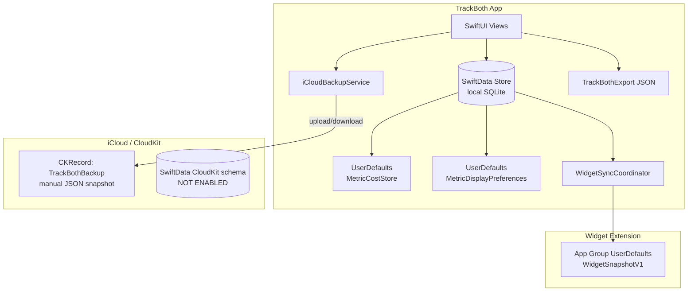
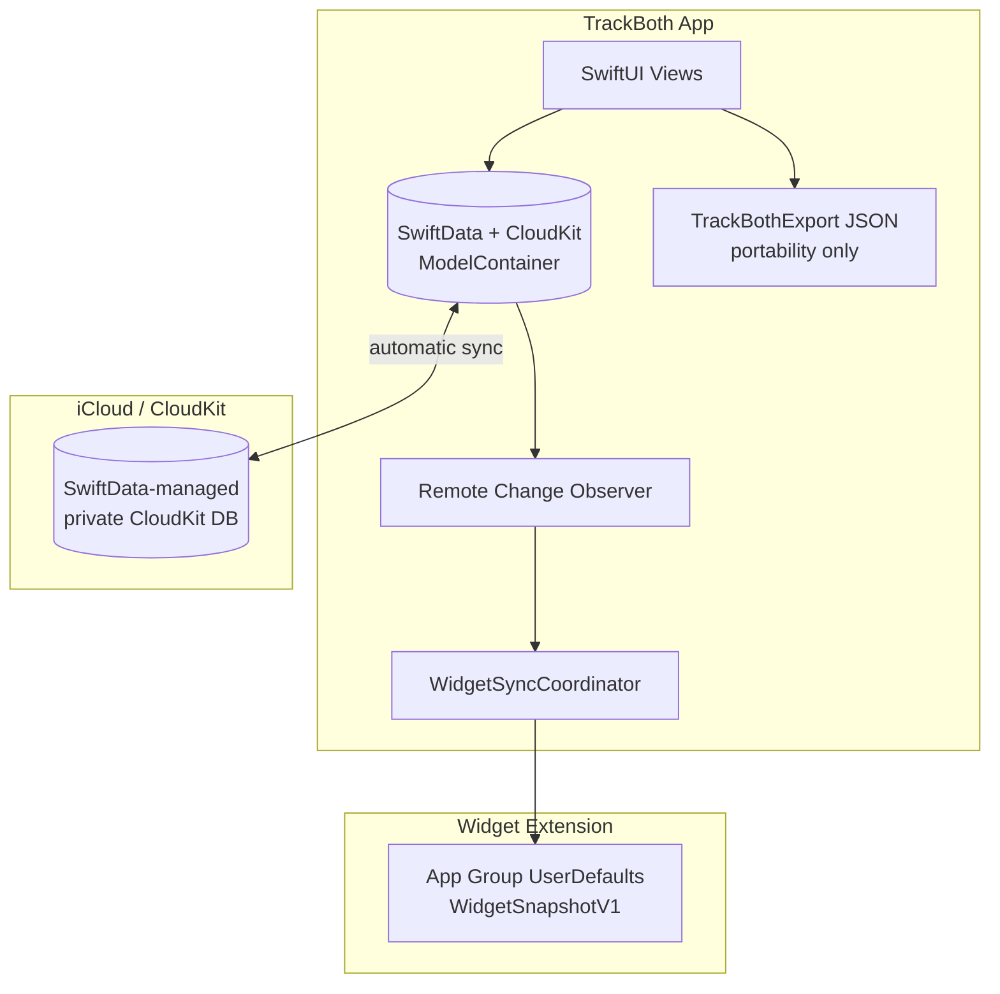

# SwiftData iCloud Migration Plan

**Status:** Deferred — CloudKit removed for 1.0; app ships local-only SwiftData + JSON export/import  
**Last updated:** 2026-06-15  
**Target release:** Post-1.0 (when cross-device sync is prioritized)  
**Owner:** TrackBoth engineering  

> **Note:** Phases A–D were implemented briefly, then reverted for 1.0.0. Legacy manual iCloud backup remains removed. Re-enable CloudKit by restoring entitlements, bootstrap ladder, Settings sync UX, and docs below.

---

## 1. Executive summary

TrackBoth today persists habit data in **local-only SwiftData** and uses a **separate manual CloudKit backup** (`iCloudBackupService`) that snapshots data into custom `TrackBothBackup` records. These are two different systems sharing one iCloud container identifier.

**Goal:** Replace manual iCloud backup/restore with **SwiftData + CloudKit automatic sync** — the Apple-native path where `ModelContainer` owns persistence and CloudKit replication.

**Why now (pre-release):**
- No shipped users with `TrackBothBackup` CKRecords to migrate
- Manual backup caused a Settings crash when entitlements were misconfigured
- Three divergent data formats (SwiftData, JSON export, CloudKit snapshot) create maintenance risk
- SwiftData CloudKit sync is the long-term architecture described in aspirational specs (`Specs/updated-specs.md`)

**Non-goals for this migration:**
- Live multi-user collaboration
- Background sync scheduling beyond what SwiftData/CloudKit provides
- Widget extension reading SwiftData directly (widgets keep App Group snapshot pattern)
- Replacing JSON export/import (remains user-controlled portability)
- watchOS / WidgetKit shipping (unchanged ProductSurface gating)

---

## 2. Current architecture

### 2.1 Data flow today



### 2.2 SwiftData (local only)

| Component | Path | Notes |
|-----------|------|-------|
| Container bootstrap | `TrackBoth/Domain/Data/BootstrapStoreRecovery.swift` | `ModelContainer(for: schema)` — no `cloudKitDatabase` |
| App wiring | `TrackBoth/TrackBothApp.swift` | `sharedModelContainer` via `BootstrapStoreRecovery.makeContainer()` |
| Models | `Metric.swift`, `MetricEntry.swift`, `Goal.swift` | `@Model` classes; entry links metric by UUID, not `@Relationship` |
| Launch migration | `MigrationUtils.swift` | `hasBeenLogged` backfill on every launch |
| Recovery | `MigrationRecoveryView.swift` | Banner when in-memory fallback active |

### 2.3 Manual iCloud backup (to remove)

| Component | Path | Notes |
|-----------|------|-------|
| Service | `TrackBoth/Utils/Services/iCloudBackupService.swift` | Raw CloudKit: `CKRecord` type `TrackBothBackup` |
| Backup UI | `TrackBoth/Components/Inputs/BackupSheet.swift` | Create + upload flow |
| Restore UI | `TrackBoth/Components/Inputs/RestoreSheet.swift` | Download + destructive replace |
| Settings wiring | `TrackBoth/Tabs/SettingsView.swift` | iCloud section + `loadBackupInfo()` on appear |
| Tests | `TrackBoth/Tests/Unit/iCloudBackupServiceTests.swift` | Local encode/restore only |
| Entitlements | `TrackBoth/TrackBoth.entitlements` | `iCloud.com.jacobrozell.TrackBoth` + CloudKit |

**CloudKit record contract (legacy):**
- Record type: `TrackBothBackup`
- Fields: `timestamp`, `version` (`"1.0"`), `backupData` (CKAsset → JSON)
- Payload: `BackupData` with embedded goals (unlike JSON export)
- Query: latest by `timestamp`; each backup creates a **new** record (no upsert)

### 2.4 JSON export/import (keep, fix gaps)

| Component | Path | Notes |
|-----------|------|-------|
| Schema | `TrackBoth/Domain/Data/TrackBothExport.swift` | Schema v3; metrics + entries only |
| Import | `TrackBoth/Domain/Data/ExportImportService.swift` | Destructive replace-all |
| Settings | `SettingsView.swift` | Export share sheet + file importer |
| Tests | `TrackBoth/Tests/Unit/ExportImportTests.swift` | Round-trip coverage |

**Known gap:** JSON export does **not** include `Goal` entities. Manual iCloud backup does. This must be fixed before removing iCloud backup so export remains a complete portability path.

### 2.5 Data outside SwiftData (sync risk)

| Store | Path | In iCloud backup? | In JSON export? | SwiftData sync? |
|-------|------|-------------------|-----------------|-----------------|
| `MetricCostStore` | `Domain/Metrics/MetricCostStore.swift` | Yes | Yes (v3) | **No** — UserDefaults |
| `MetricDisplayPreferences` | `Domain/Metrics/MetricDisplayPreferences.swift` | No | No | **No** — UserDefaults |
| Theme / week start | `ThemePreferences`, `@AppStorage` | No | No | **No** — per device (acceptable) |

---

## 3. Target architecture

### 3.1 Data flow after migration



### 3.2 Design decisions

| Decision | Choice | Rationale |
|----------|--------|-----------|
| Sync model | SwiftData private CloudKit database | Apple-native; no custom CKRecord types |
| Container ID | Reuse `iCloud.com.jacobrozell.TrackBoth` | Entitlements already configured |
| Manual backup UI | **Remove** | Replaced by implicit sync |
| JSON export | **Keep** | User-controlled backup, support, migration |
| JSON import | **Keep** | Offline restore, support tooling |
| Sync toggle | Settings toggle (opt-in default ON when signed in) | Privacy-friendly; matches "optional iCloud" copy |
| Delete all data | Local wipe + optional cloud purge | Behavior must be re-specified (see §6) |
| Pre-release migration | Delete legacy `TrackBothBackup` CKRecords in dev | No user migration tooling needed |

---

## 4. Schema and model changes

### 4.1 Enable CloudKit on ModelContainer

**File:** `BootstrapStoreRecovery.swift`

```swift
let schema = Schema([Metric.self, MetricEntry.self, Goal.self])
let config = ModelConfiguration(
    "TrackBoth",
    schema: schema,
    cloudKitDatabase: .private("iCloud.com.jacobrozell.TrackBoth")
)
return try ModelContainer(for: schema, configurations: [config])
```

**Requirements:**
- Same container identifier as current entitlement
- iOS 17+ (already minimum deployment)
- Xcode capability: iCloud + CloudKit + Background Modes (remote notifications, optional but recommended for timely sync)

### 4.2 CloudKit schema constraints

SwiftData CloudKit sync imposes constraints. Audit each model:

| Model | Property | CloudKit risk | Action |
|-------|----------|---------------|--------|
| `Metric` | `id: UUID` | OK with default | Keep |
| `Metric` | `habitType: HabitType` (enum) | OK if Codable/raw representable | Verify |
| `Metric` | `goals` cascade relationship | OK | Keep |
| `MetricEntry` | `metricID: UUID` (no relationship) | Orphan entries possible on sync | **Consider** `@Relationship` to `Metric` (Phase B) |
| `Goal` | `metric` inverse | OK | Keep |
| All models | Non-optional without defaults | Rejected by CloudKit | Audit — current models appear compliant |

### 4.3 Introduce VersionedSchema (recommended before ship)

**File:** new `TrackBoth/Domain/Data/TrackBothSchema.swift`

Per `Specs/SwiftData.md`, introduce `VersionedSchema` before any field changes ship. This migration is the right time:

```swift
enum TrackBothSchemaV1: VersionedSchema {
    static var versionIdentifier = Schema.Version(1, 0, 0)
    static var models: [any PersistentModel.Type] {
        [Metric.self, MetricEntry.self, Goal.self]
    }
}
```

Future schema changes (e.g. moving `costPerUnit` into `Metric`) use `SchemaMigrationPlan`.

### 4.4 Migrate side stores into SwiftData (Phase B — strongly recommended)

| Current | Target | Benefit |
|---------|--------|---------|
| `MetricCostStore` (UserDefaults) | `Metric.costPerUnit: Decimal?` or `String?` on `@Model` | Syncs across devices |
| `MetricDisplayPreferences` (UserDefaults) | `Metric.displayOrder: Int?` or separate `@Model` | Syncs across devices |

**If deferred:** Document that vice cost estimates and display order are per-device only. Acceptable for 1.0 only if called out in release notes.

### 4.5 Unify export schema with SwiftData (Phase A — required)

**File:** `TrackBothExport.swift` → schema v4

Add goals to JSON export so removing iCloud backup does not reduce portability:

```swift
struct GoalRecord: Codable {
    let id: String
    let metricID: String
    let goalType: String
    let period: String
    let target: Int
    // ... existing Goal fields
}
```

Update `ExportImportService.importPayload` to restore goals. Add round-trip tests.

---

## 5. Implementation phases

Because the app is **unreleased**, phases can ship as one PR series without user migration windows. Ordered for safe incremental review.

### Phase A — Foundation (no UI removal yet)

**Goal:** SwiftData CloudKit sync works; manual backup still available as fallback during dogfood.

| # | Task | Files | Acceptance |
|---|------|-------|------------|
| A1 | Add `ModelConfiguration(cloudKitDatabase:)` to bootstrap | `BootstrapStoreRecovery.swift` | App launches; data persists locally |
| A2 | Add `VersionedSchema` wrapper | new `TrackBothSchema.swift`, `BootstrapStoreRecovery.swift` | Build succeeds; tests pass |
| A3 | Add iCloud account status check utility | new `CloudSyncStatus.swift` | Returns signed-in / unavailable / restricted |
| A4 | Add remote-change observer → widget refresh | `WidgetLifecycleObserver.swift` or new `CloudKitSyncObserver.swift` | Widget snapshot updates after sync (Debug) |
| A5 | Add Goals to JSON export (schema v4) | `TrackBothExport.swift`, `ExportImportService.swift`, tests | Goals survive export → import |
| A6 | Device test: two simulators same Apple ID | QA doc | Create habit on A → appears on B |

### Phase B — Settings and UX

**Goal:** Replace manual backup UX with sync status UX.

| # | Task | Files | Acceptance |
|---|------|-------|------------|
| B1 | Replace "iCloud Backup" section with "iCloud Sync" | `SettingsView.swift` | Shows sync status, last sync hint, link to iOS Settings |
| B2 | Add sync enable/disable toggle (UserDefaults) | `SettingsView.swift`, `CloudSyncPreferences.swift` | Disabling stops writes to CloudKit (local-only mode) |
| B3 | Update delete-all behavior | `SettingsView.swift`, `DeleteAllDataSpec.md` | Clear copy: local only vs local + iCloud |
| B4 | Remove `loadBackupInfo()` on appear | `SettingsView.swift` | Settings opens without CloudKit side effects |

**Proposed Settings section:**

| Row | Behavior |
|-----|----------|
| iCloud Sync (toggle) | Enable/disable CloudKit sync |
| Sync Status | "Up to date" / "Syncing…" / "iCloud unavailable" |
| Export Data | Unchanged |
| Import Data | Unchanged |
| Reset All Local Data | Unchanged (update copy) |

### Phase C — Remove manual backup stack

**Goal:** Delete dead code and legacy CloudKit record type.

| # | Task | Files | Acceptance |
|---|------|-------|------------|
| C1 | Delete `iCloudBackupService.swift` | service file | No references remain |
| C2 | Delete `BackupSheet.swift`, `RestoreSheet.swift` | component files | No references remain |
| C3 | Delete `iCloudBackupServiceTests.swift` | test file | CI green |
| C4 | Remove `TrackBothBackup` from CloudKit Dashboard | Apple Developer portal | Dev container cleaned |
| C5 | Add `CloudSyncTests` | new test file | Account-status mock; container bootstrap |

### Phase D — Documentation and release hygiene

| # | Task | Files |
|---|------|-------|
| D1 | Update tech stack spec | `Specs/TechStackSpec.md` |
| D2 | Update settings spec | `Specs/SettingsSpec.md` |
| D3 | Update export/import spec | `Specs/ExportImportSpec.md` |
| D4 | Update SwiftData spec | `Specs/SwiftData.md` |
| D5 | Update delete-all spec | `Specs/DeleteAllDataSpec.md` |
| D6 | Update privacy/support HTML | `docs/privacy.html`, `docs/support.html` |
| D7 | Update feature inventory | `docs/feature-inventory.md` |
| D8 | Update 1.0 checklists | `docs/release/1.0.0-checklist.md`, ship checklist |
| D9 | Update ProductSurface if needed | `Specs/ProductSurfaceSpec.md` |

---

## 6. Behavioral changes requiring spec updates

### 6.1 Delete All Local Data

**Today:** `DeleteAllDataSpec.md` says iCloud backup is unaffected.

**After migration:** Options (pick one):

| Option | Behavior | UX copy |
|--------|----------|---------|
| **A (recommended)** | Delete local only; cloud copy re-syncs on next launch | "Deletes data on this device. Other devices and iCloud may restore it." |
| **B** | Delete local + purge CloudKit zone | "Deletes all data everywhere." Requires `NSPersistentCloudKitContainer` purge API |
| **C** | Delete local; disable sync until user re-enables | Middle ground |

**Recommendation:** Option A for 1.0 with clear alert copy. Option B as explicit second button "Delete everywhere" if product wants it.

### 6.2 Privacy and support copy

**Today (`docs/privacy.html`):**
> "If you tap Backup to iCloud or Restore from iCloud…"

**After:**
> "If you enable iCloud Sync, your habit data is stored in your private iCloud account and syncs across your devices via Apple CloudKit. TrackBoth does not operate its own servers."

### 6.3 Bootstrap failure

CloudKit-enabled `ModelContainer` can fail when:
- iCloud account restricted
- Schema incompatible with existing cloud data
- Disk full

**Plan:** Extend `BootstrapStoreRecovery` fallback ladder:

1. Try CloudKit-enabled persistent store
2. On failure → try local-only persistent store (no CloudKit)
3. On failure → in-memory fallback + `MigrationRecoveryView` banner
4. Never `fatalError` in production path (per `Specs/MigrationRecoverySpec.md`)

---

## 7. Widget integration

Widgets **must not** adopt SwiftData + CloudKit directly (separate process, no model access).

**Required change:** Observe SwiftData remote changes in the app and refresh widget snapshot.

```swift
// Pseudocode — CloudKitSyncObserver
NotificationCenter.default.addObserver(
    forName: .NSPersistentStoreRemoteChange,
    ...
) { _ in
    WidgetSyncCoordinator.syncIfEnabled(context: modelContext)
}
```

**Also:**
- Add App Group entitlement to `TrackBoth-Widget.entitlements` (currently empty) before widget ships
- No change to `WidgetSnapshotV1` format

---

## 8. Entitlements and Xcode capabilities

### 8.1 Main app (`TrackBoth.entitlements`)

Keep:
```xml
<key>com.apple.developer.icloud-container-identifiers</key>
<array>
    <string>iCloud.com.jacobrozell.TrackBoth</string>
</array>
<key>com.apple.developer.icloud-services</key>
<array>
    <string>CloudKit</string>
</array>
<key>com.apple.security.application-groups</key>
<array>
    <string>group.com.trackboth.app</string>
</array>
```

### 8.2 Xcode project capabilities

Enable in `TrackBoth` target:
- [x] iCloud → CloudKit → container `iCloud.com.jacobrozell.TrackBoth`
- [ ] Background Modes → Remote notifications (recommended for sync push)

### 8.3 CloudKit Dashboard

After migration:
- SwiftData auto-creates record types (do not manually define `TrackBothBackup`)
- Delete dev `TrackBothBackup` record type and test records
- Verify SwiftData schema appears under container

---

## 9. Testing plan

### 9.1 Unit tests

| Test | File | Covers |
|------|------|--------|
| Bootstrap with CloudKit config | `BootstrapStoreRecoveryTests.swift` | Container creation (in-memory CloudKit not available — use entitlement guard) |
| Export v4 includes goals | `ExportImportTests.swift` | Goals round-trip |
| Cloud sync status | new `CloudSyncStatusTests.swift` | Account unavailable → graceful |
| Delete all inventory | existing + update | SwiftData empty; side stores cleared |

### 9.2 Integration / device tests

| # | Scenario | Devices | Pass criteria |
|---|----------|---------|---------------|
| T1 | Fresh install, iCloud signed in | 2 simulators, same Apple ID | Habit created on A appears on B within 60s |
| T2 | Fresh install, iCloud signed out | 1 simulator | App works local-only; Settings shows unavailable |
| T3 | Settings open | 1 simulator | No crash (regression for 2026-06-15 bug) |
| T4 | Export → delete → import | 1 simulator | Full data restored including goals |
| T5 | Delete all local | 2 simulators | Documented behavior matches spec |
| T6 | Airplane mode edit → reconnect | 1 device | Local edits merge to cloud |

### 9.3 UI tests

| Test | Status |
|------|--------|
| `testSettingsSheetOpens` | Keep (regression) |
| `testSettingsBackupRestore` | **Remove** after Phase C |
| `testSettingsSyncStatus` | **Add** in Phase B |

### 9.4 Remove obsolete tests

- `iCloudBackupServiceTests.swift` — delete in Phase C (backup encode logic moves to export tests if needed)

---

## 10. Files to delete (Phase C)

```
TrackBoth/Utils/Services/iCloudBackupService.swift
TrackBoth/Components/Inputs/BackupSheet.swift
TrackBoth/Components/Inputs/RestoreSheet.swift
TrackBoth/Tests/Unit/iCloudBackupServiceTests.swift
```

**References to grep before deletion:**
- `iCloudBackupService`
- `BackupSheet`
- `RestoreSheet`
- `BackupData`
- `BackupError`
- `loadBackupInfo`
- `showingBackupSheet`
- `showingRestoreSheet`

---

## 11. Files to create

| File | Purpose |
|------|---------|
| `TrackBoth/Domain/Data/TrackBothSchema.swift` | VersionedSchema |
| `TrackBoth/Utils/Services/CloudSyncStatus.swift` | Account status + entitlement checks |
| `TrackBoth/Domain/Data/CloudSyncPreferences.swift` | User toggle for sync on/off |
| `TrackBoth/Utils/Services/CloudKitSyncObserver.swift` | Remote change → widget refresh |
| `TrackBoth/Tests/Unit/CloudSyncStatusTests.swift` | Unit coverage |
| `TrackBoth/Tests/UI/SettingsSyncUITests.swift` (optional) | Sync status UI |

---

## 12. Files to modify (summary)

| File | Change |
|------|--------|
| `BootstrapStoreRecovery.swift` | CloudKit ModelConfiguration + fallback ladder |
| `TrackBothApp.swift` | Wire sync observer |
| `SettingsView.swift` | Replace iCloud backup section with sync status |
| `TrackBothExport.swift` | Schema v4 + goals |
| `ExportImportService.swift` | Import goals |
| `WidgetLifecycleObserver.swift` | Trigger sync on remote change |
| `TrackBoth-Widget.entitlements` | Add app group (when widget ships) |
| `Specs/*.md` | See Phase D |
| `docs/privacy.html`, `docs/support.html` | Copy updates |

---

## 13. Risks and mitigations

| Risk | Severity | Mitigation |
|------|----------|------------|
| Dual CloudKit schemas during Phase A | Medium | Complete Phase C before RC; delete `TrackBothBackup` records |
| Goals lost via JSON export | High | Phase A5 before Phase C |
| `MetricCostStore` not synced | Medium | Phase B side-store migration or document per-device |
| Delete-all vs cloud re-sync surprises users | Medium | Clear alert copy; spec decision in §6.1 |
| CloudKit schema rejection | High | VersionedSchema + device test early in Phase A |
| Simulator sync flakiness | Low | Use real device for T1; simulators for local-only |
| Bootstrap failure with CloudKit | Medium | Fallback ladder §6.3 |
| Widget stale after remote sync | Medium | `CloudKitSyncObserver` §7 |
| Signing/provisioning without CloudKit capability | High | Verify Xcode capability + portal container before merge |

---

## 14. Acceptance criteria (migration complete)

- [x] `ModelContainer` uses `cloudKitDatabase: .private("iCloud.com.jacobrozell.TrackBoth")`
- [x] No references to `iCloudBackupService`, `BackupSheet`, or `RestoreSheet`
- [x] Settings opens without crash; shows iCloud Sync status (not Backup/Restore)
- [x] JSON export/import includes goals (schema v4)
- [ ] Two devices with same Apple ID sync habit create/edit/delete (device QA)
- [x] iCloud signed-out path works local-only with clear Settings message
- [x] Widget snapshot refreshes after remote sync (observer wired)
- [x] All unit + UI tests pass
- [x] Specs and privacy/support docs updated
- [ ] `TrackBothBackup` CKRecord type removed from dev CloudKit container (manual portal step)
- [x] 1.0 checklist updated: replace "iCloud backup → delete → restore" with "iCloud sync across devices"

---

## 15. Open questions (resolve before Phase B)

| # | Question | Default if no answer |
|---|----------|----------------------|
| Q1 | Should `costPerUnit` move into `Metric` model now? | Yes — include in Phase B |
| Q2 | Delete-all: local only or purge cloud too? | Local only (Option A) |
| Q3 | Sync on by default or opt-in? | On when iCloud signed in |
| Q4 | Show "last synced" timestamp in Settings? | Yes, if API available |
| Q5 | Keep demo data section unchanged? | Yes |

---

## 16. Related documents

| Document | Relevance |
|----------|-----------|
| `Specs/SwiftData.md` | Container bootstrap, migration policy |
| `Specs/ExportImportSpec.md` | JSON contract |
| `Specs/SettingsSpec.md` | Settings sections |
| `Specs/DeleteAllDataSpec.md` | Reset behavior |
| `Specs/MigrationRecoverySpec.md` | Bootstrap failure UX |
| `Specs/planned/WidgetSpec.md` | Widget does not use SwiftData sync |
| `Specs/ProductSurfaceSpec.md` | Release gating |
| `docs/release/1.0.0-checklist.md` | QA items |
| `docs/privacy.html` | Legal copy |

---

## 17. Suggested PR sequence

1. **PR1 — Schema + export v4:** VersionedSchema, goals in JSON, tests
2. **PR2 — CloudKit bootstrap:** ModelConfiguration, fallback ladder, CloudSyncStatus
3. **PR3 — Settings sync UX:** Replace backup section, delete-all copy
4. **PR4 — Remove legacy backup:** Delete iCloudBackupService stack, update docs
5. **PR5 — Side store migration (optional):** `costPerUnit` on Metric model

Each PR should keep CI green and be reviewable independently.

---

*End of plan.*
